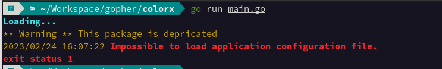

# Colorit - Preview



## Welcome! 👋

Colorit is a Go Lang package that helps to easily alter the text color in a terminal environment. 

## How to install the package
**To use this packge we assumed you already have "GO" installed on your computer.**

Open the project you want to work with
```console
~$ cd your-project-directory
~$ go mod init your-project-name
~$ go get -u github.com/asamoahe3/colorit
```

## How to Use

```go
   package main
   
   import(
    "fmt"
     "github.com/asamoahe3/colorit"
   )

   func main() {
	 errMsg := "Something unexpected has occured."
     greetings := "Happy coding"

     fmt.Println(colorit.Red + errMsg)
     fmt.Println(colorit.Green + greetings)
}
```

**Have fun building!** 🚀
